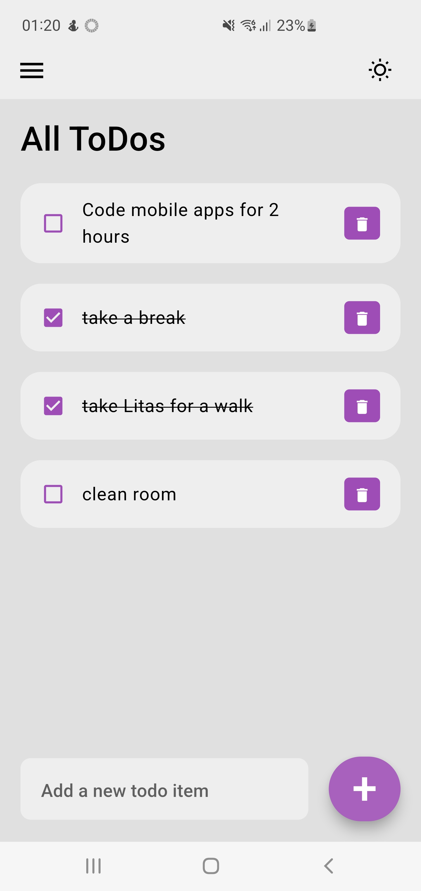
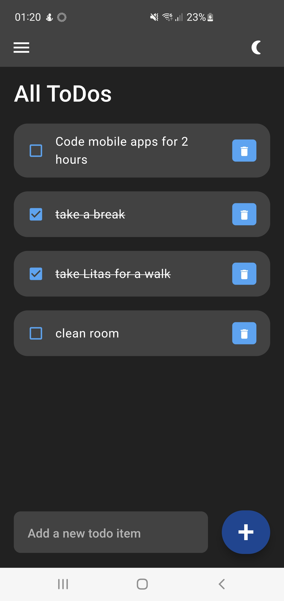

# todo_app

## Mobile app for smart device programming course.

A ToDo list app for **saving** todos, **marking** them as done and **deleting** chosen ones.

App is in an early development state, but once developed it will have these features:
- [x] switch between light and dark theme with option to save theme configuration.
- [x] cache todo and the state of it in the local storage.
- [ ] possibility to group todos.

## Application interface view

### Light theme

### Dark theme

